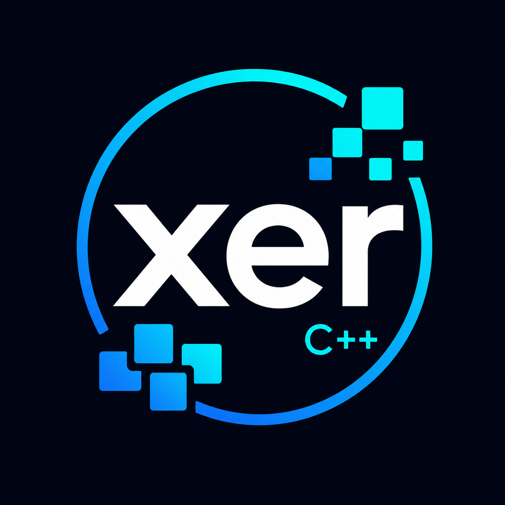

# xer C++ Utility Library

<p align="center">
  
</p>

<p align="center">
  <a href="https://github.com/takagi-nobuhisa/xer">GitHub</a>
  ·
  <a href="https://x.com/xercpplib">X: @xercpplib</a>
  ·
  <a href="https://note.com/xercpplib">note</a>
</p>

[日本語版 README / Japanese README](README.ja.md)

xer is a header-only C++23 library designed for programmers who are familiar with C and want a simpler, more predictable alternative to overly abstract C++ APIs.

It keeps the spirit of the C standard library where that style is still practical, but redesigns the APIs as a modern C++ library with stronger typing, explicit error handling, and Unicode-aware text processing.

## Links

- [GitHub](https://github.com/takagi-nobuhisa/xer)
- [X: @xercpplib](https://x.com/xercpplib)
- [note](https://note.com/xercpplib): articles about how to use xer and other practical or interesting topics

## Status

xer is under active development.

The project began by rebuilding practical parts of the C standard library in a way that fits its design goals. It now also covers adjacent areas that benefit from the same approach, including structured data handling, ZIP archive utilities, fixed-schema binary serialization, practical mathematics, descriptive statistics, and lightweight vector/geometry helpers, process and socket utilities, Tcl/Tk integration, a lightweight image/canvas subsystem, and Japanese text-processing helpers such as MeCab-based wakachi-gaki, furigana formatting, kansuji conversion, and braille conversion.

The current library scope includes:

- string and character handling
- Unicode code point traversal, grapheme cluster traversal, grapheme-cluster-based string operations, practical emoji detection, and NFC normalization
- I/O and filesystem-oriented utilities
- binary data helpers, including checksums, CRC, hex conversion, MD5, SHA-1, and SHA-256
- ZIP archive reading, writing, lookup, and extraction
- fixed-schema binary serialization with generated `xfer` structures
- path handling
- arithmetic helpers, elementary mathematics, descriptive statistics, lightweight vector/geometry helpers, complex-equation helpers, and numeric utility types
- time utilities
- JSON, INI, and TOML handling
- process and socket utilities
- Tcl/Tk integration
- image/canvas drawing, bitmap fonts, basic pixel processing, and arc drawing with τrad angles
- Japanese text helpers, including kansuji, furigana, MeCab integration, kana/romaji wakachi-gaki, and braille conversion

This project does **not** aim at full source-level compatibility with the C standard library, PHP, or platform APIs, even when familiar names are reused.

## Design goals

- Familiar to C programmers
- Header-only
- C++23-based
- Explicit and predictable behavior
- Minimal reliance on locale
- Practical Unicode support
- Avoid unnecessary abstraction
- Prefer simple APIs over clever APIs

## Supported environments

Current official compiler target:

- GCC 13.3.0 or later

Current supported and tested environments:

- Ubuntu
- MSYS2 UCRT64

Current platform scope:

- Linux through Ubuntu
- Windows through MSYS2 UCRT64

Current Windows version target:

- Windows 11 or later

Unsupported environments:

- MSYS2 MSYS
- MSYS2 MINGW64

MSYS2 MSYS and MSYS2 MINGW64 are not included in the current or planned test matrix. If a clear need appears in the future, support for those environments may be reconsidered at that time.

Visual C++ and Clang may be considered later, but they are not official targets yet.

## Key characteristics

### 1. Header-only

xer is intended to be usable by including headers only.

### 2. Error handling based on `std::expected`

Normal failures are represented with `std::expected` through `xer::result`.
Internal invariant violations are handled separately through xer's assert mechanism.

### 3. Clear separation of API layers

- `xer` for regular public APIs
- `xer::advanced` for lower-level advanced APIs
- `xer::detail` for internal implementation details

### 4. Unicode and encoding policy

xer intentionally limits its text-encoding scope to:

- CP932
- UTF-8
- UTF-16
- UTF-32

In regular APIs:

- strings are primarily UTF-8
- individual text characters may use `char32_t`
- CP932 is supported for interoperability with existing environments
- language-oriented text handling primarily targets English and Japanese; broader script-specific behavior is left to user extensions or dedicated Unicode libraries

### 5. Locale-independent design

xer does not place locale-dependent behavior at the center of its design.
For example, character classification and text conversion are designed around explicit project rules rather than the host locale.

### 6. I/O built on `FILE`-style foundations

xer does not use `iostream` as its foundation.
Instead, it builds on `FILE`-style I/O and exposes redesigned stream types such as:

- `binary_stream`
- `text_stream`

### 7. Mathematics, geometry, and angle policy

xer provides small mathematics helpers for practical formulas and lightweight geometry rather than a full numerical-computing framework. This includes equation helpers, two-, three-, and four-dimensional `vec<T, N>` types, polar/cartesian conversion, vector operations, and simple rotation helpers.

Angles used by xer math, matrix, and image APIs are based on τrad units unless explicitly documented otherwise. In this convention, `1` means one full turn, `0.25` means a right angle, and `0.5` means a half turn. APIs that represent cyclic angles use `cyclic<T>`. Conversion helpers such as `from_rad`, `to_rad`, `from_degree`, and `to_degree` are provided when interaction with radians or degrees is needed.

### 8. Practical Japanese text-processing helpers

xer includes small Japanese text-processing building blocks that are useful in ordinary tools and examples. Japanese-specific APIs are collected under the `xer::ja` namespace:

- kansuji conversion
- furigana formatting
- MeCab-based morphological parsing and wakachi-gaki helpers
- kana and romaji conversion helpers built on MeCab readings
- braille constants and language-neutral / English low-level helpers under `xer::braille`
- Japanese kana-braille helpers under `xer::ja`
- MeCab-based braille translation

The braille facilities are practical building blocks. They do not claim to be a complete, standards-grade braille translation engine, and MeCab-based conversion depends on the readings produced by the external MeCab dictionary.

## Public headers

Current public headers:

- `xer/error.h`
- `xer/assert.h`
- `xer/typeinfo.h`
- `xer/diag.h`
- `xer/scope.h`
- `xer/string.h`
- `xer/ctype.h`
- `xer/braille.h`
- `xer/stdlib.h`
- `xer/kansuji.h`
- `xer/mecab.h`
- `xer/furigana.h`
- `xer/ja.h`
- `xer/unicode.h`
- `xer/bytes.h`
- `xer/base64.h`
- `xer/binary.h`
- `xer/zip.h`
- `xer/serialize.h`
- `xer/parse.h`
- `xer/json.h`
- `xer/ini.h`
- `xer/toml.h`
- `xer/stdio.h`
- `xer/iostream.h`
- `xer/path.h`
- `xer/dirent.h`
- `xer/socket.h`
- `xer/tk.h`
- `xer/stdint.h`
- `xer/stdfloat.h`
- `xer/arithmetic.h`
- `xer/math.h`
- `xer/statistics.h`
- `xer/complex.h`
- `xer/cyclic.h`
- `xer/interval.h`
- `xer/color.h`
- `xer/quantity.h`
- `xer/matrix.h`
- `xer/image.h`
- `xer/process.h`
- `xer/cmdline.h`
- `xer/time.h`
- `xer/version.h`

Headers under `xer/bits/` are internal implementation details.

## Repository layout

```text
xer/
  xer/        public headers
  xer/bits/   internal implementation headers
  tests/      test programs
  examples/   example programs
  php/        development-time helper scripts
  docs/       design documents and reference materials
```

## Example

```cpp
#include <iostream>
#include <xer/path.h>
#include <xer/arithmetic.h>

int main()
{
    xer::path base(u8"C:/work");
    xer::path file(u8"docs/readme.txt");

    auto joined = base / file;
    auto sum = xer::add(10u, -3);

    std::cout << reinterpret_cast<const char*>(joined.str().data()) << '\n';

    if (sum.has_value()) {
        std::cout << *sum << '\n';
    }
}
```

## Development notes

The repository contains PHP scripts used for development tasks such as:

- generating conversion tables
- generating test cases
- driving compile/run tests
- collecting test results

PHP is a development tool for xer itself.
It is **not required** for users who only want to use the library.

## Non-goals for the current stage

At least for now, xer does not aim to provide:

- full locale support
- full reproduction of every C standard header
- `iostream`-based design
- complete compatibility with all host-specific behavior
- immediate support for every compiler
- complete Japanese reading disambiguation or complete braille translation

Some headers are intentionally not provided as standalone public headers. Mathematical and complex-number helpers now have dedicated public headers, while narrower implementation details remain under `xer/bits/`.

## Documentation

Design documents and reference materials are available under `docs/`.

- [Reference manual](docs/xer_reference_manual_en.md)

These documents describe the current direction of the project, including:

- project overview
- encoding policy
- path handling
- I/O design
- arithmetic and mathematics behavior
- cyclic values, angle units, and quantity units
- MeCab integration policy
- Tcl/Tk integration policy
- image/canvas and bitmap-font policy
- coding conventions
- test and code-generation policy
- serialization policy
- external-component policy

## License

Boost Software License 1.0.
See [LICENSE](LICENSE).

## Why the name “xer”?

The project is designed as a C++23 library for programmers of the X generation who grew up with C-style programming.
